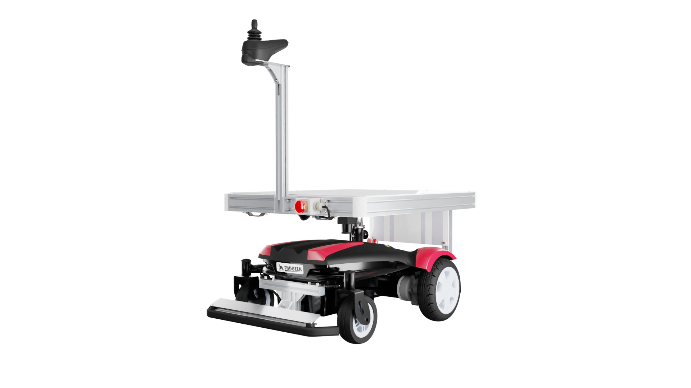
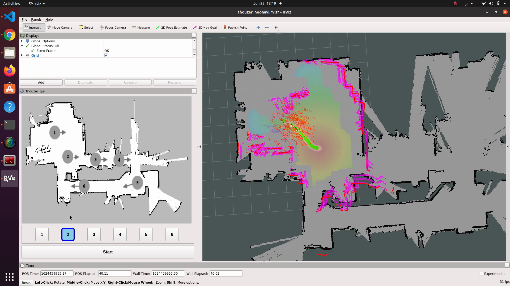

# thouzer_ros

Doog社が販売する[サウザー（THOUZER）](https://doog-inc.com/type-transport/)をROSのインターフェースから操作するためのROSパッケージです。




## 動作環境

以下の環境で動作確認をしています。

* THOUZER
  * Doog社製
* IMU
  * アールティ製 [USB出力9軸IMUセンサモジュール](https://rt-net.jp/products/usb9imu/)
* PC
  * Ubuntu 20.04
  * Docker version 20.10.4
  * docker-compose 1.29.2

## 使い方
### 接続方法

THOUZERに搭載されているWi-Fiのアクセスポイントに接続します。  
ルータを介して、有線接続をすることも可能です。  

詳しいアクセス方法については本体マニュアルをご参照ください。

```
┌──────────────────────────────────────────────┐
│                                              │
│    ┌───────────────┐   ┌─────────────────┐   │         ┌─────────────────────┐
│    │               │   │    Ethernet     │   │         │                     │
│    │               ├───┤  Switching Hub  │   │         │                     │
│    │               │   └────────┬────────┘   │         │                     │
│    │               │            │            │         │                     │
│    │               │   ┌────────┴────────┐   │  Wi-Fi  │                     │  USB   ┌──────────────┐
│    │               │   │                 ├───┼─────────┤                     ├────────┤              │
│    │  Built-in PC  │   │     Wi-Fi AP    │   │         │     ROS Node PC     │        │     IMU      │
│    └───────────────┘   └─────────────────┘   │         └─────────────────────┘        └──────────────┘
│                   THOUZER                    │
└──────────────────────────────────────────────┘
```

### ソフトウェア起動方法

#### 準備

Docker内のGUIアプリケーション起動を許可します（PC起動後1回実施すればOKです）

```sh
xhost +local:root
```

ビルド

```sh
docker-compose build
```

#### 起動

##### ロボット通信用ノードのみ起動

```sh
docker-compose up robot
```

##### ロボット通信用ノード＋RViz起動

```sh
docker-compose up robot rviz
```

##### ロボット通信用ノード＋デバッグ用ターミナル（[Terminator](https://terminator-gtk3.readthedocs.io/en/latest/)）起動

```sh
docker-compose up robot debugger
```

##### ロボット通信用ノード＋デバッグ用byobu起動

```sh
# 1枚目の端末で
docker-compose up robot
# 2枚目の端末で
docker run --rm -it --network=host rt-net/thouzer_driver byobu
```

##### NVIDIAのGPUがないPCでrosbagを使ってSLAMのテストをする場合

以下のコマンドを実行します

```sh
# ビルド
docker-compose build nogpu-debugger
# Terminatorの起動
docker-compose up nogpu-debugger
```

### ROS
#### 1. THOUZERの操作に必要なノードを起動

THOUZER本体のドライバおよびLiDAR用ノードを起動

```sh
roslaunch thouzer_bringup thouzer_robot.launch
```

#### 2. THOUZERのデバッグに必要なノードを起動

(Optional) デバッグ用にRVizを起動します

```sh
roslaunch thouzer_bringup thouzer_remote_debugger.launch
```

#### 3. THOUZERでSLAM (GMapping)

地図作成をするために[GMapping](http://wiki.ros.org/gmapping)ノードを起動します

```sh
roslaunch thouzer_slam slam_gmapping.launch
```

#### 4. THOUZERでNavigation

作成した地図を元にナビゲーションをします。  
デフォルトでは[neonavigation](https://github.com/at-wat/neonavigation)と[amcl](http://wiki.ros.org/amcl)を採用しています。
##### 実機使用

※`thouzer_bringup/launch/thouzer_robot.launch`を起動後に実行する必要があります

```sh
roslaunch thouzer_navigation thouzer_navigation.launch
```

##### シミュレータ使用

実機を使わずに生成される経路を確認することもできます

```sh
roslaunch thouzer_navigation thouzer_navigation.launch simulate:=true
```


## FAQ

### Dockerコンテナ起動時にGUIウィンドウが表示されない

Dockerコンテナを立ち上げた時に以下のログが表示された場合

```
debugger_1  | No protocol specified
debugger_1  | Unable to init server: Could not connect: Connection refused
debugger_1  | No protocol specified
debugger_1  | Unable to init server: Could not connect: Connection refused
debugger_1  | You need to run terminator in an X environment. Make sure $DISPLAY is properly set
```

以下のコマンドが正常に実行できていません。再度実行してエラーを確認してください。

```sh
xhost +local:root
```


## 階層説明
### thouzer_bringup

THOUZER起動用launchをまとめたパッケージです。  
基本的にここにあるLaunchファイルを起動します。
デバッグ用のRVizも起動できます。

### thouzer_description

THOUZERのセンサの座標定義パッケージです。  
センサのtfに関する情報をpublishするようにしています。  

### thouzer_driver

TOUZER内のPCとの通信しROSのインターフェースを用意するためのパッケージです。  
通信およびオドメトリの計算に必要な各種ノードの設定やスクリプトをまとめています。

`config/mqtt.yaml`内に接続先の情報を記載します。接続情報やAPIについてはTHOUZERのマニュアルを参照してください。

### thouzer_msgs

THOUZER用のメッセージ定義ファイルをまとめたパッケージです。  
THOUZER内のPCとMQTTで通信する際には[groove-x/mqtt_bridge](https://github.com/groove-x/mqtt_bridge/tree/python2.7)を使用しており、mqtt_bridgeと組み合わせて使用する各種メッセージファイルを定義しています。  

### thouzer_slam

地図生成用のパッケージです。  
[GMapping](http://wiki.ros.org/gmapping)を利用しています。

### thouzer_navigation

Navigation Stack用のパッケージです。  
[neonavigation](https://github.com/at-wat/neonavigation)と[amcl](http://wiki.ros.org/amcl)を利用しています。

### thouzer_teleop

THOUZERをキーボードやゲームコントローラ（Logicool社製F710にて動作確認）で操作するためのパッケージです。

### waypoint_gui

ナビゲーションする際にWaypointを複数指定するためのROSパッケージです。  
詳細は[rt-net/waypoint_gui](https://github.com/rt-net/waypoint_gui)を参照してください。



※画像は開発中のものです

## License

(C) 2021 RT Corporation

各ファイルはライセンスがファイル中に明記されている場合、そのライセンスに従います。特に明記されていない場合は、Apache License, Version 2.0に基づき公開されています。  
ライセンスの全文は[LICENSE](./LICENSE)または[https://www.apache.org/licenses/LICENSE-2.0](https://www.apache.org/licenses/LICENSE-2.0)から確認できます。

※このソフトウェアは基本的にオープンソースソフトウェアとして「AS IS」（現状有姿のまま）で提供しています。本ソフトウェアに関する無償サポートはありません。  
バグの修正や誤字脱字の修正に関するリクエストは常に受け付けていますが、それ以外の機能追加等のリクエストについては社内のガイドラインを優先します。

※このソフトウェアはDoog社が提供するものではありません。本ソフトウェアについてDoog社へのお問合わせはお控えください。
